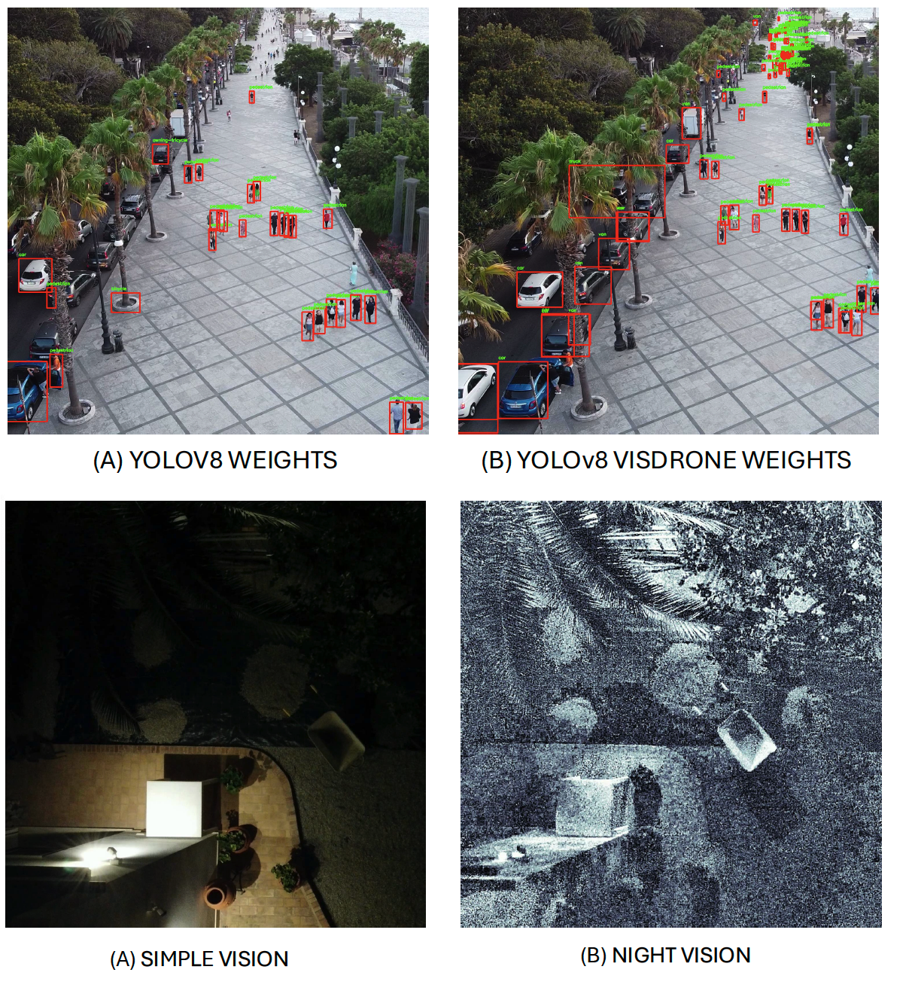

# Project Overview



## Description
This project is a comprehensive framework for analyzing video and image data in various scenarios, including real-time dynamic and static processing, night vision enhancement, motion detection, and evaluation of object detection metrics. It is designed to handle both video streams and stored files, offering robust functionality for diverse applications.

## Features

### 1. Dynamic Real-Time Processing (`1_Dynamic_realtime.py`)
- Processes video frames dynamically in real-time.
- Adapts between different object detection models (YOLOv8 and VisDrone) based on detected conditions such as object size.
- Saves processed frames and annotations for further analysis.
- Designed to handle both local video files and RTMP streaming.

### 2. Static Real-Time Processing (`2_Static_realtime.py`)
- Focuses on real-time processing of video streams with static analysis techniques.
- Processes frames at a predefined rate for consistent analysis.
- Includes support for saving annotations and processed images.

### 3. Night Vision Image Processing (`3_Night_Filter_Image.py`)
- Enhances visibility in low-light conditions by applying noise reduction and brightness amplification.
- Specifically designed for processing images in dark environments.

### 4. Night Vision Video Processing (`3_Night_vision.py`)
- Applies night vision enhancements to videos.
- Utilizes amplification and filtering techniques to improve frame clarity.
- Incorporates timestamp overlay and annotation storage.

### 5. Evaluation Metrics (`4_evalutation_metrics.py`)
- Calculates precision, recall, and IoU metrics for object detection tasks.
- Generates consensus annotations by combining results from multiple detection systems (YOLOv8, VisDrone, and dynamic analysis).
- Saves average metrics and detailed results to CSV files.

### 6. Motion Detection (`basicmotiondetector.py`)
- Detects motion in video streams using frame differencing and thresholding techniques.
- Highlights motion regions based on defined parameters such as minimum area and delta threshold.
- Supports adaptive background subtraction for efficient detection.

## Requirements

Ensure the following dependencies are installed before running the scripts:
- Python 3.7+
- OpenCV
- NumPy
- Matplotlib
- Torch (for YOLOv8 and VisDrone integration)
- Scikit-learn
- Imutils

## Usage

### Clone the Repository
```bash
git clone <repository_url>
cd <repository_folder>
